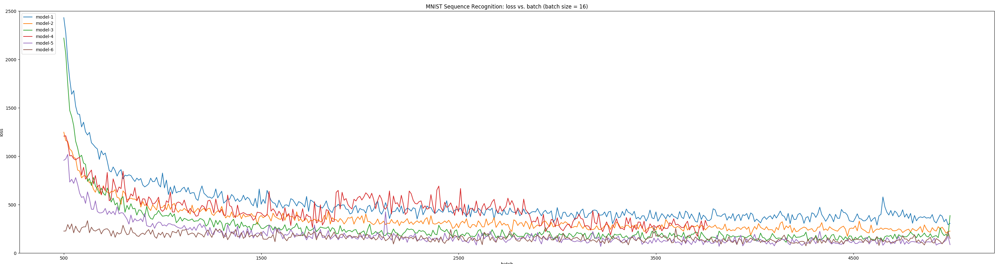
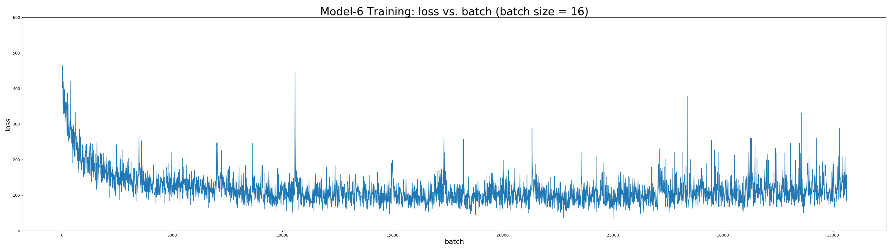
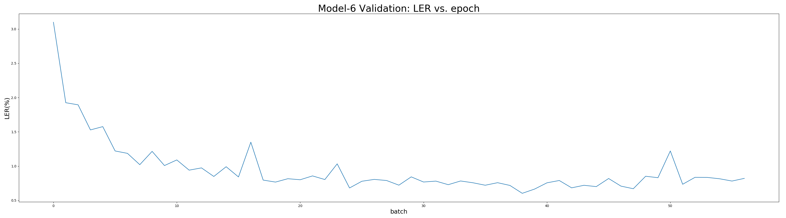

# Introduction

There is a readme.html which is converted from this markdown file for demonstration.

`CTCLoss.py`

- Pytorch implementation of Connectionist Temporal Classification (CTC) loss function by extending `torch.autograd`

`CNN_LSTM_FC_model.py`

- A Pytoch based CNN+LSTM+CTC model

`train.py`

- Trainig script

# Code

For the sake of convenience, a test shell script test.sh is provided for testing the pretrained model on test set. Simply run the following, and it will help set up the environment and fit the model automatically:

```shell
sh test.sh
```

## Environment Set Up
The running environment is set up in Python 2.7.10.
By running `virtualenv`, it could help set up the environment based on the `requirements.txt` easily:

```shell
# Create and activate new virtual environment
virtualenv venv
source venv/bin/activate

# Install requirements
pip install -r requirements.txt
```

## Code Description

Different models are encapsulated as subclasses of Pytorch `nn.Module`, with forward function implemented. To change the model to train, only need to import different model modules in `main.py`. E.g.:

```python
from model_bilstm import *
```

The scrip `main.py` allows to train the model from the beginning or pretrained model, fit the samples based on pretrained model, and plot figures. The detailed usage is as follows:

```shell
(virtual_env)bash-3.2$ python main.py -h
usage: main.py [-h] [--batch-size N] [--validate-batch-size N] [--epoch N]
               [--lr LR] [--momentum M] [--cuda] [--seed S] [--log-interval N]
               [--eval] [--model-path MP] [--id ID] [--train-len TRLEN]
               [--test-len TELEN]

Sequence MNIST Recognition

optional arguments:
  -h, --help            show this help message and exit
  --batch-size N        input batch size for training (default: 32)
  --validate-batch-size N
                        input batch size for validating (default: 10)
  --epoch N             number of epochs to train (default: 20)
  --lr LR               learning rate (default: 0.01)
  --momentum M          SGD momentum (default: 0.5)
  --cuda                enables CUDA training
  --seed S              random seed (default: 1)
  --log-interval N      how many batches to wait before logging training
                        status
  --eval                evaluate a pretrained model
  --model-path MP       path to the model to evaluate/resume
  --id ID               id of each training instance
  --train-len TRLEN     number of digits in each sequence image (training)
  --test-len TELEN      number of digits in each sequence image (testing)
```

The `main.py` script also supports checkpoint mechanism (which saves the best model after each epoch) and log function (logs loss and edit distance on training set after each batch and those on validation set after each epoch).

## Run the Code: Test Model

The best model with 90.88% accuracy on Cifar10 test set at epoch 339 with loss of 0.4994 are stored as all_cnn_weights_0.9088_0.4994.hdf5. The following code loads the pretrained model and then fits the test data:

```shell

python main.py --

```

# Evaluation Metrics

Due to the nature of the sequence recognition, accuracy is not appropriate here as evaluation metric since for example only one different digit in one hundred digits will result in accuracy 0 even if all the other 99 are matched with the target. In this case,  label error rate (LER) combined with edit distance is used.

## Edit Distance

Edit distance is a way of quantifying how dissimilar two strings (e.g., words) are to one another by counting the minimum number of operations required to transform one string into the other. Different definitions of an edit distance use different sets of string operations. The Levenshtein distance operations are the removal, insertion, or substitution of a character in the string. Being the most common metric, the Levenshtein distance is usually what is meant by "edit distance". In our experiments, Levenshtein distance is used.

## Label Error Rate (LER)

Given a test set $S' \subset{D_{X \times Z}}$ disjoint from $S$, define the label error rate (LER) of a temporal classifier $h$ as the mean normalised edit distance between its classifications and the targets on $S'$ , i.e

$$ \frac{1}{|S'|}\sum_{(x,z)\in{S'}}\frac{ED(h(x),z)}{|z|} $$

where $ED(p,q)$ is the edit distance between two sequences p and q — i.e. the minimum number of insertions, substitutions and deletions required to change p into q.

This is a natural measure for tasks (such as speech or handwriting recognition) where the aim is to minimise the rate of transcription mistakes.

# Connectionist Temporal Classification (CTC)

## Forward & Backward

# Decoding

Given the probability distribution $P(l|x)$, we can compute a label $l$ for an input sequence $x$ by taking the most likely label. Thus, given that $L^{\leqslant T}$ is the set of sequences of length less than or equal to $T$ with letters drawn from the alphabet $L$, we can express our desired classifier h(x) as follows:

$$ h(x) = \arg \max_{\ell \in L^{\le T}} P(\ell | x) $$

Computing the most likely $l$ from the probability distribution $P(l|x)$ is known as decoding. However, given that the alphabet $L$ and the maximum sequence length $T$ may be quite large, it is computationally intractable to examing every possible $l \in L^{\leqslant T}$. There is no known algorithm to efficiently compute this $h(x)$ precisely; however, there are several ways to approximate decoding which work well enough in practice.

Traditionally, decoding is done in one of following two ways.

## Best Path Decoding

The first traditional decoding strategy is best path decoding, which assumes that the most likely path corresponds to the most likely label. This is not necessarily true: suppose we have one path with probability $0.1$ corresponding to label A, and ten paths with probability $0.05$ each corresponding to label B. Clearly, label B is preferable overall, since it has an overall probability of $0.5$; however, best path decoding would select label A, which has a higher probability than any path for label B.

Best path decoding is fairly simple to compute; simply look at the most active output at every timestep, concatenate them, and convert them to a label (via removing blanks and duplicates). Since at each step we choose the most active output, the resulting path is the most likely one.

# Network Architecture

Basically, the images are first processed by a CNN to extract features, then these extracted features are fed into a RNN. Then, the output from RNN are fed into a softmax layer to convert each output to a probability distribution over 11 classes (i.e. 10 digits and 1 blank). Finally, the probability distribution is the input to the final CTC layer.

The architecture of CNN is just Convolution + Batch Normalization + Relu activation + Max Pooling for simplicity and specifically LSTM is used as RNN units.

## Model-1: lCNN (CNN with large kernei size) + LSTM + CTC

The second model uses a kernel size with the same height as the image. This is required by the write-up.

|           	| Model-1: lCNN (CNN with large kernei size) + LSTM + CTC       	|
|-----------	|---------------------------------------------------------------	|
| Conv1     	| 1 input channel, 36*2 kernel size, 10 feature map, stride = 1 	|
| Maxpool1  	| 10 input channel, 1*2 kernel size, stride = 1                 	|
| Conv2     	| 10 input channel, 1*2 kernel size, 20 feature map, stride = 1 	|
| Maxpool2  	| 20 input channel, 1*2 kernel size, stride = 1                 	|
| Batchnorm 	|                                                               	|
| LSTM      	| 32 hidden size, 1 hidden layer                                	|
| Softmax   	| =>11                                                          	|
| CTC       	|                                                               	|

## Model-2: lCNN (CNN with large kernei size) + BLSTM + CTC

The third model uses a kernel size with the same height as the image. Rather than the typical LSTM, it uses bidirectional LSTM. Standard LSTM can only use past contextual information in one direction. However, in terms of the contiguous hand-written digit sequence recognition, bidirectional contextual knowledge may be neeeded. Bidirectional LSTM (BLSTM) can learn long-range context dynamics in both input directions and significantly outperform unidirectional networks.

|           	| Model-1: lCNN (CNN with large kernei size) + BLSTM + CTC       	|
|-----------	|---------------------------------------------------------------	|
| Conv1     	| 1 input channel, 36*2 kernel size, 10 feature map, stride = 1 	|
| Maxpool1  	| 10 input channel, 1*2 kernel size, stride = 1                 	|
| Conv2     	| 10 input channel, 1*2 kernel size, 20 feature map, stride = 1 	|
| Maxpool2  	| 20 input channel, 1*2 kernel size, stride = 1                 	|
| Batchnorm 	|                                                               	|
| BLSTM      	| 32 hidden size, 1 hidden layer                                	|
| Softmax   	| =>11                                                          	|
| CTC       	|                                                               	|

## Model-3: lCNN (CNN with large kernei size) + BLSTM (2 layers) + CTC

|           	| Model-1: lCNN (CNN with large kernei size) + BLSTM + CTC       	|
|-----------	|---------------------------------------------------------------	|
| Conv1     	| 1 input channel, 36*2 kernel size, 10 feature map, stride = 1 	|
| Maxpool1  	| 10 input channel, 1*2 kernel size, stride = 1                 	|
| Conv2     	| 10 input channel, 1*2 kernel size, 20 feature map, stride = 1 	|
| Maxpool2  	| 20 input channel, 1*2 kernel size, stride = 1                 	|
| Batchnorm 	|                                                               	|
| BLSTM      	| 32 hidden size, 2 hidden layers                                	|
| Softmax   	| =>11                                                          	|
| CTC       	|                                                               	|

## Model-4: sCNN (CNN with samll kernei size) + LSTM + CTC

The first model has the following architecture:

|           | Model-1: sCNN (CNN with samll kernei size) + LSTM + CTC       |
|-----------|---------------------------------------------------------------|
| Conv1     | 1 input channel, 5*5 kernel size, 10 feature map, stride = 1  |
| Maxpool1  | 10 input channel, 2*2 kernel size, stride = 2                 |
| Conv2     | 10 input channel, 5*5 kernel size, 20 feature map, stride = 1 |
| Maxpool2  | 20 input channel, 2*2 kernel size, stride = 2                 |
| Batchnorm |                                                               |
| Dropout   | p = 0.5                                                       |
| LSTM      | 32 hidden size, 1 hidden layer                                |
| Softmax   | =>11                                                          |
| CTC       |                                                               |

## Model-5: sCNN (CNN with small kernei size) + BLSTM (2 layers) + CTC

|           	| Model-1: lCNN (CNN with large kernei size) + BLSTM + CTC       	|
|-----------	|-------------------------------------------------------------------|
| Conv1     	| 1 input channel, 5*5 kernel size, 10 feature map, stride = 1 	    |
| Maxpool1  	| 10 input channel, 2*2 kernel size, stride = 2                 	|
| Conv2     	| 10 input channel, 5*5 kernel size, 20 feature map, stride = 1 	|
| Maxpool2  	| 20 input channel, 2*2 kernel size, stride = 2                 	|
| Batchnorm 	|                                                               	|
| BLSTM      	| 32 hidden size, 2 hidden layers                                	|
| Softmax   	| =>11                                                          	|
| CTC       	|                                                               	|

## Model-6: scaled-sCNN (CNN with small kernei size) + BLSTM (2 layers) + CTC

|           	| Model-1: lCNN (CNN with large kernei size) + BLSTM + CTC       	|
|-----------	|-------------------------------------------------------------------|
| Conv1     	| 1 input channel, 3*3 kernel size, 10 feature map, stride = 1 	    |
| Conv2     	| 10 input channel, 5*5 kernel size, 20 feature map, stride = 1 	|
| Maxpool    	| 20 input channel, 3*3 kernel size, stride = 3                 	|
| Conv3     	| 20 input channel, 5*5 kernel size, 25 feature map, stride = 1 	|
| Batchnorm 	|                                                               	|
| Dropout    	| p = 0.5                                                         	|
| BLSTM      	| 32 hidden size, 2 hidden layers                                	|
| Softmax   	| =>11                                                          	|
| CTC       	|                                                               	|

Validation set (100-10000): Average loss: 2.6410, Average edit dist: 0.7509

# Experiments
## Experiment settings

- Optimizer: Adam optimizer with `learning rate=0.01`, `betas=(0.9, 0.999)`, `eps=1e-8`, `weight_decay=0`. Batch size is set to `16`.

- Training set: 10000 samples with 100 digits in each sample
- Validation set: 1000 samples with 100 digits in each sample

The experiment environment is in Python 2.7 and built up AWS p2 instance - powered by Tesla K80 Accelerators,with one GPU that provides 12 GiB of memory.

# Experiment


As shown above, model-6 converges fastest and achieves best performance. Furthermore, the detailed statistics of model-6 after 58 epochs is as followed:




The best performance of model-6 is in epoch 40 with average LER **0.603%** and loss **2.087** on validation set.

# Performance on different sequence length

The stability of the model is also tested. As show below, a 

- training(20)/test(5)

    Validation set: Average loss: 0.4893, Average edit dist: 0.1348

- training(20)/test(20)

    Validation set: Average loss: 1.6601, Average edit dist: 0.4023

- training(20)/test(100)

    Validation set: Average loss: 16.9200, Average edit dist: 4.4844


# 

- Model-6 trained on normal_10000 after 41 epochs:

    - random_1000:

        Validation set: Average loss: 111.4074, Average edit dist: 12.7760

    - normal_1000:

        Validation set: Average loss: 2.2551, Average edit dist: 0.6470
        

- Model-6 trained on random_10000 (from beginning) after 31 epochs:

    - random_1000:
    
        Validation set: Average loss: 12.4041, Average edit dist: 3.0410

    - normal_1000:

        Validation set: Average loss: 14.9714, Average edit dist: 4.0700